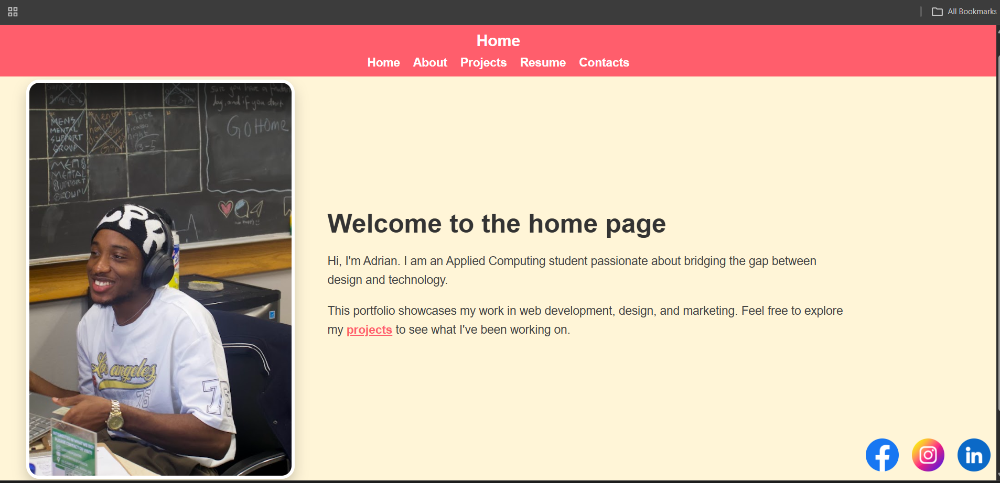
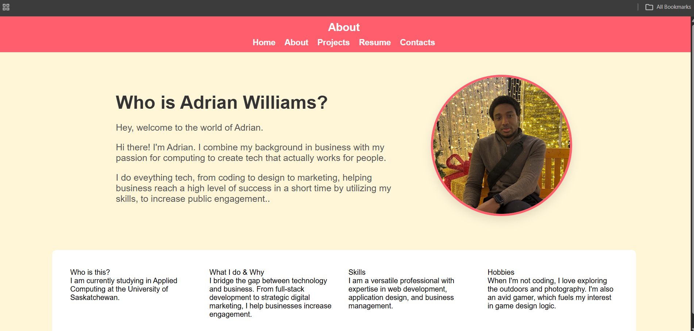
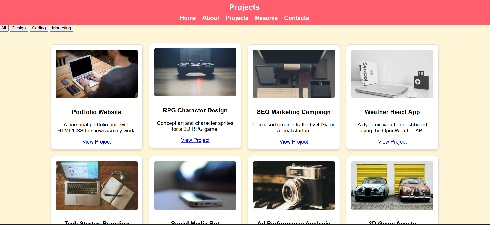
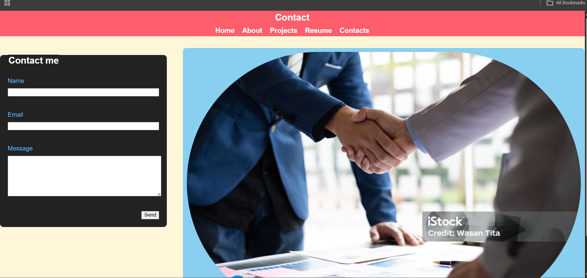

# Frontend Playground

A lightweight multi-page website built while exploring the fundamentals of front-end web development. The project focuses on creating responsive page layouts and adding simple interactive features using HTML, CSS, and JavaScript.

## Features

- Multi-page website with consistent navigation
- Responsive layouts for different screen sizes
- Interactive image slideshow
- Project filtering functionality
- Contact form with client-side validation
- Responsive navigation menu
- Social media links

## Technologies Used

- HTML5
- CSS3
- JavaScript

## Screenshots

### Home Page



### About Page



### Projects Page



### Contact Page



## Running Locally

Clone the repository:

```bash
git clone https://github.com/AdrianOse-dev/Frontend-Playground.git
```

Navigate into the project folder and open `home_page.html` in your browser.

For the best experience, you can also run the project using a local development server such as Live Server.

## What I Practiced

This project gave me an opportunity to work with core front-end development concepts, including:

- Structuring multi-page websites with HTML
- Creating responsive layouts with CSS
- Manipulating the DOM with JavaScript
- Handling form input and client-side validation
- Building simple interactive UI components
- Maintaining consistent navigation and styling across multiple pages

## Future Improvements

- Improve overall accessibility
- Add smoother page and slideshow transitions
- Further improve mobile responsiveness
- Add more interactive components
- Refine the overall user interface and visual consistency
